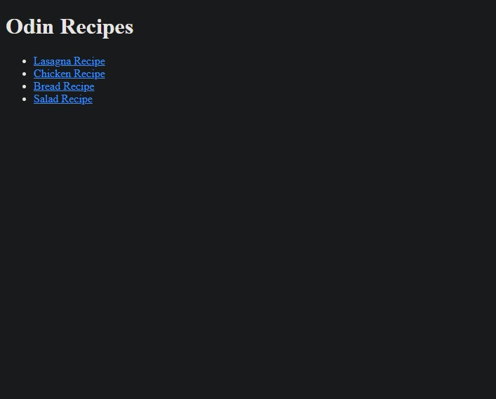

# odin-recipes

## Project Introduction

Welcome to the Odin Recipes project! In this hands-on coding exercise, I'll be building a simple recipe website from scratch. This project will allow me to demonstrate my skills in HTML and web page structuring, as well as linking between pages. I'll create an index page that serves as the homepage for my recipe website and individual recipe pages that contain detailed information about each dish, including images, descriptions, ingredients, and steps.

### By the end of this project, I will have demonstrated the following

#### 1. HTML Basics

- I'll become familiar with the basics of HTML, including creating and structuring web pages.

#### 2. Linking Pages

- I'll learn how to link multiple web pages together to create a cohesive website.

#### 3. Adding Images

- I'll understand how to incorporate images into the web pages to enhance the visual appeal.

#### 4. Organizing Content

- I'll practice organizing and presenting content effectively using headings, paragraphs, lists, and more.

This project offers a great opportunity to apply my knowledge of HTML in a practical and enjoyable way. However, please note that I won't be publishing the website for viewing on the web just yet. See the images below for a preview of some finished pages.

